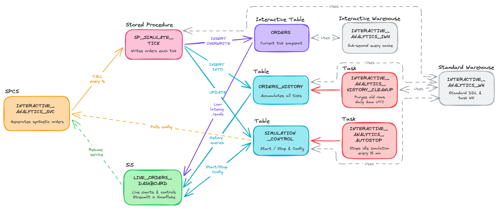

# Build a Real-Time BI Dashboard with Interactive Tables

A complete, self-contained demo that generates live synthetic e-commerce orders inside Snowflake and serves a continuously updating BI dashboard — no Kafka, no external message bus, no infrastructure outside Snowflake.

## Architecture



The system is built entirely inside a single Snowflake account across three layers:

1. A containerized **SPCS simulation service** runs a tight loop, calling a JavaScript stored procedure every second to generate synthetic orders. The stored procedure writes those orders into an **interactive table** whose cache is kept warm by an **interactive warehouse**, enabling sub-second reads by the dashboard.

   ```
   INTERACTIVE_ANALYTICS_SVC (SPCS)
     │  polls SIMULATION_CONTROL for is_running / mode / config
     └─ CALL SP_SIMULATE_TICK
             ├─ INSERT OVERWRITE ──▶ ORDERS (Interactive Table)
             │                            └─ INTERACTIVE_ANALYTICS_IWH serves low-latency reads
             ├─ INSERT INTO ──────▶ ORDERS_HISTORY (Table)
             └─ UPDATE ───────────▶ SIMULATION_CONTROL (total_orders, last_active_at)
   ```

2. A **Streamlit in Snowflake** app surfaces live KPI tiles, charts, and simulation controls — it reads the current snapshot through the interactive warehouse and queries accumulated history through the standard warehouse.

   ```
   LIVE_ORDERS_DASHBOARD
     ├─ reads ORDERS via INTERACTIVE_ANALYTICS_IWH    (KPI tiles, live chart)
     ├─ reads ORDERS_HISTORY via INTERACTIVE_ANALYTICS_WH  (time-series, heatmap)
     ├─ reads/writes SIMULATION_CONTROL              (Start / Stop / Flash Sale / New session)
     └─ resumes INTERACTIVE_ANALYTICS_SVC when suspended
   ```

3. Two background tasks handle cost management automatically: one stops an idle simulation, the other purges old history rows daily.

   ```
   INTERACTIVE_ANALYTICS_AUTOSTOP (serverless task, every 15 min)
     └─ sets SIMULATION_CONTROL.is_running = FALSE when idle > 1 hour
          → INTERACTIVE_ANALYTICS_SVC self-suspends and exits

   INTERACTIVE_ANALYTICS_HISTORY_CLEANUP (warehouse task, daily 2am UTC)
     └─ uses INTERACTIVE_ANALYTICS_WH
     └─ deletes ORDERS_HISTORY rows older than 1 day
   ```

## Prerequisites

| Requirement | Notes |
|---|---|
| Snowflake account with `ACCOUNTADMIN` | Must be in a [region that supports interactive tables/warehouses](https://docs.snowflake.com/en/user-guide/interactive#region-availability) and [SPCS](https://docs.snowflake.com/en/developer-guide/snowpark-container-services/overview#available-regions) |
| [Docker Desktop](https://docs.docker.com/get-docker/) | For building the simulation container |
| [Git](https://git-scm.com/) | For cloning this repo |

## Quickstart

### 1. Run the setup SQL

Open a Snowsight worksheet and run `scripts/setup.sql` as `ACCOUNTADMIN`. The script is idempotent — safe to re-run.

When the script finishes, copy the `repository_url` value from the `SHOW IMAGE REPOSITORIES` output. It looks like:
```
<orgname>-<accountname>.registry.snowflakecomputing.com/interactive_streaming_demo/public/sim_repo
```

### 2. Build and push the container image

```bash
# From the repo root
docker build -t simulation ./spcs/

# Apple Silicon? Add --platform linux/amd64
# docker build --platform linux/amd64 -t simulation ./spcs/

docker login <your_registry_url>

docker tag simulation <your_registry_url>/simulation:latest
docker push <your_registry_url>/simulation:latest
```

### 3. Deploy the SPCS simulation service

```sql
USE ROLE ACCOUNTADMIN;
USE WAREHOUSE INTERACTIVE_ANALYTICS_WH;

CREATE SERVICE IF NOT EXISTS
  INTERACTIVE_STREAMING_DEMO.PUBLIC.INTERACTIVE_ANALYTICS_SVC
  IN COMPUTE POOL INTERACTIVE_ANALYTICS_POOL
  FROM SPECIFICATION $$
  spec:
    container:
    - name: simulator
      image: /interactive_streaming_demo/public/sim_repo/simulation:latest
      env:
        SNOWFLAKE_WAREHOUSE: INTERACTIVE_ANALYTICS_WH
        SIM_INTERVAL: "1"
        IDLE_SUSPEND_SECS: "3600"
        ROWS_BASE: "100"
        CTRL_CACHE_TICKS: "5"
  $$
  MIN_INSTANCES = 1
  MAX_INSTANCES = 1;

-- Wait until RUNNING (typically 30-60 seconds)
SHOW SERVICES LIKE 'INTERACTIVE_ANALYTICS_SVC'
  IN SCHEMA INTERACTIVE_STREAMING_DEMO.PUBLIC;
```

### 4. Deploy the Streamlit dashboard

Using SnowSQL or the Snowflake Python connector, from the `streamlit/` directory:

```sql
PUT file://streamlit_app.py
    @INTERACTIVE_STREAMING_DEMO.PUBLIC.APP_STAGE/streamlit/
    OVERWRITE=TRUE AUTO_COMPRESS=FALSE;

PUT file://environment.yml
    @INTERACTIVE_STREAMING_DEMO.PUBLIC.APP_STAGE/streamlit/
    OVERWRITE=TRUE AUTO_COMPRESS=FALSE;

CREATE OR REPLACE STREAMLIT INTERACTIVE_STREAMING_DEMO.PUBLIC.LIVE_ORDERS_DASHBOARD
  ROOT_LOCATION   = '@INTERACTIVE_STREAMING_DEMO.PUBLIC.APP_STAGE/streamlit'
  MAIN_FILE       = 'streamlit_app.py'
  QUERY_WAREHOUSE = INTERACTIVE_ANALYTICS_WH
  TITLE           = 'Live Orders Dashboard';
```

Open the app in Snowsight under **Streamlit > LIVE_ORDERS_DASHBOARD**.

### 5. Explore the dashboard

Click **Start** in the sidebar. The simulation begins generating orders immediately. Try:
- **Rate multiplier** — scale order volume up or down
- **Flash Sale** — spike a product category to 50 % of all orders
- **New session** — clear history and reset counters for a fresh demo

## Cost notes

- **Interactive warehouse** (`INTERACTIVE_ANALYTICS_IWH`) has a **24-hour minimum billing period** once created. Drop it as soon as you are done.
- **Compute pool** (`INTERACTIVE_ANALYTICS_POOL`) auto-suspends after 1 hour of idle time.
- **AUTOSTOP task** sets `is_running = FALSE` after 1 hour of dashboard inactivity, which triggers the service to self-suspend.

## Clean up

Run the commented-out `Clean up` block at the bottom of `scripts/setup.sql`, or paste:

```sql
USE ROLE ACCOUNTADMIN;
UPDATE INTERACTIVE_STREAMING_DEMO.PUBLIC.SIMULATION_CONTROL SET is_running = FALSE;
ALTER TASK INTERACTIVE_STREAMING_DEMO.PUBLIC.INTERACTIVE_ANALYTICS_AUTOSTOP SUSPEND;
ALTER TASK INTERACTIVE_STREAMING_DEMO.PUBLIC.INTERACTIVE_ANALYTICS_HISTORY_CLEANUP SUSPEND;
DROP SERVICE      IF EXISTS INTERACTIVE_STREAMING_DEMO.PUBLIC.INTERACTIVE_ANALYTICS_SVC;
DROP STREAMLIT    IF EXISTS INTERACTIVE_STREAMING_DEMO.PUBLIC.LIVE_ORDERS_DASHBOARD;
DROP TASK         IF EXISTS INTERACTIVE_STREAMING_DEMO.PUBLIC.INTERACTIVE_ANALYTICS_AUTOSTOP;
DROP TASK         IF EXISTS INTERACTIVE_STREAMING_DEMO.PUBLIC.INTERACTIVE_ANALYTICS_HISTORY_CLEANUP;
DROP PROCEDURE    IF EXISTS INTERACTIVE_STREAMING_DEMO.PUBLIC.SP_SIMULATE_TICK(VARCHAR, VARCHAR, FLOAT, VARCHAR, FLOAT);
DROP WAREHOUSE    IF EXISTS INTERACTIVE_ANALYTICS_IWH;
DROP WAREHOUSE    IF EXISTS INTERACTIVE_ANALYTICS_WH;
DROP COMPUTE POOL IF EXISTS INTERACTIVE_ANALYTICS_POOL;
DROP DATABASE     IF EXISTS INTERACTIVE_STREAMING_DEMO;
```

## Full tutorial

See the [step-by-step quickstart guide](quickstart/build-real-time-bi-dashboard-interactive-tables/build-real-time-bi-dashboard-interactive-tables.md) for a detailed walkthrough with explanations of each Snowflake object.
